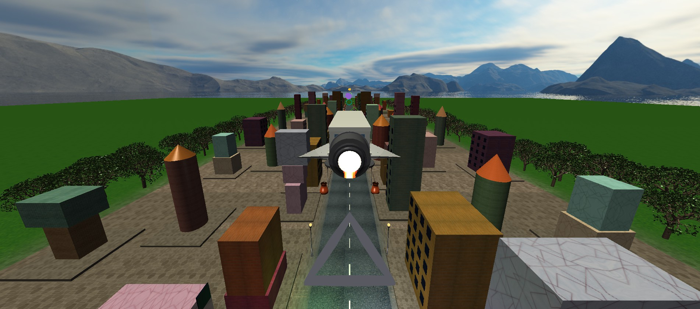
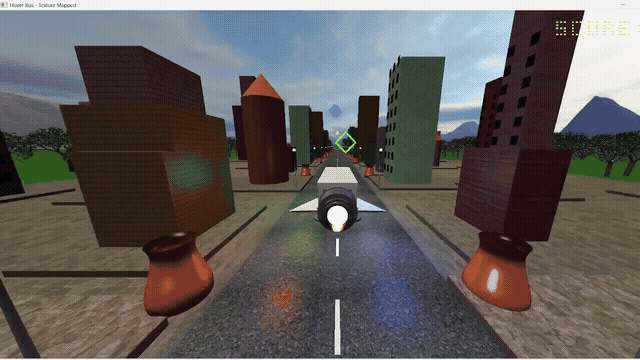
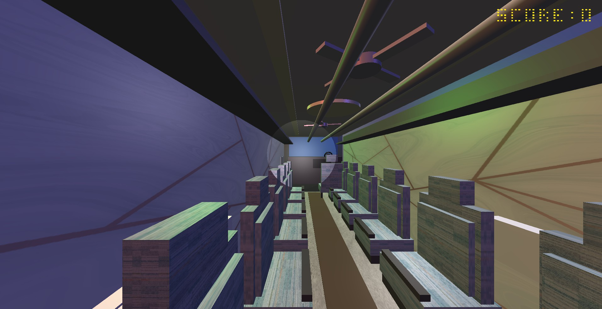
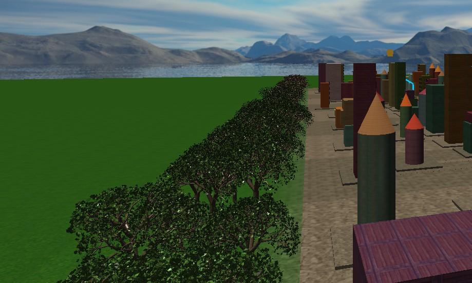
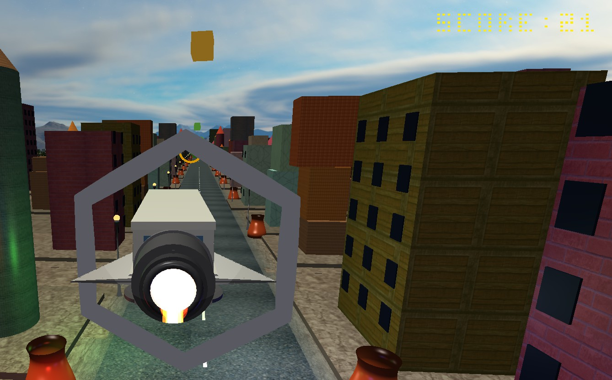
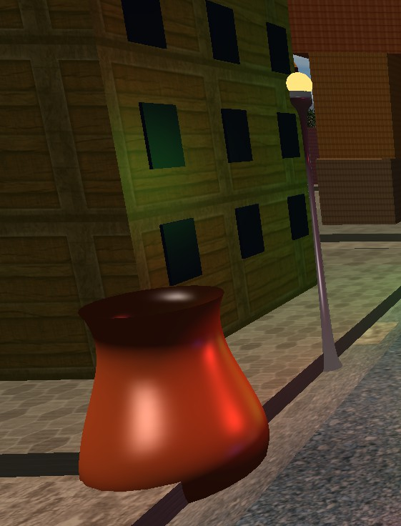
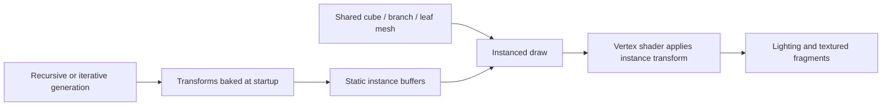
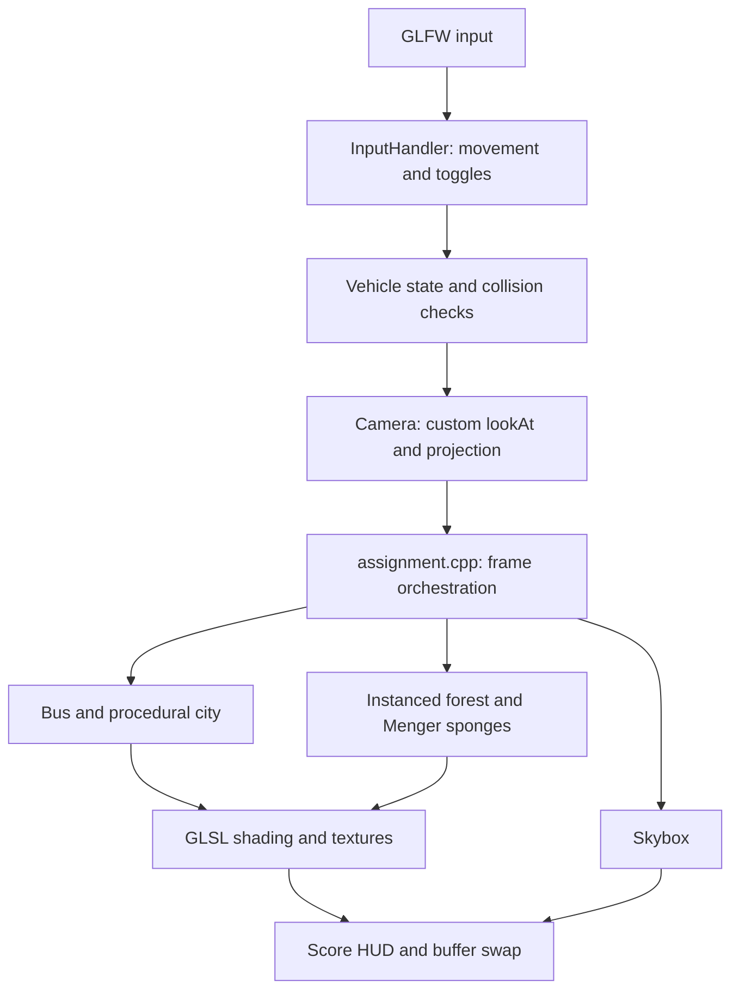

# 3D Hover Vehicle Game

**Fly a custom-built hover bus through a procedural city — powered by C++, OpenGL 3.3, and GLSL.**

A real-time graphics project that brings together procedural geometry, GPU-instanced fractals, interactive lighting, vehicle movement, and checkpoint gameplay. The vehicle and environment are assembled in code from primitives and parametric surfaces.

[](https://github.com/Mofazzal874/Graphics/actions/workflows/windows-build.yml)

[Demo video](https://github.com/Mofazzal874/Graphics/raw/refs/heads/main/docs/media/demo.mp4) · [Project report](docs/submissions/report.pdf) · [Presentation](docs/submissions/presentation.pdf) · [Source](Project/assignment.cpp)



## See it in motion

[](https://github.com/Mofazzal874/Graphics/raw/refs/heads/main/docs/media/demo.mp4)

**[Watch or download the full 2:06 demonstration](https://github.com/Mofazzal874/Graphics/raw/refs/heads/main/docs/media/demo.mp4).** The MP4 preserves the original recording's video and audio streams. The animated preview plays directly in this README; the full video opens separately.

## What I built

- **A controllable hover vehicle:** acceleration, steering, altitude control, animated doors, wings, fan, hover pads, and engine flames, with a detailed passenger interior.
- **A procedural city:** deterministic building placement, a scrolling road corridor, street furniture, and a repeating fractal forest extending around the moving vehicle.
- **Three camera perspectives:** chase, interior, and free camera, with a custom `lookAt` implementation, mouse look, zoom, and orbit controls.
- **A programmable lighting system:** directional light, four point lights, a spotlight, emissive effects, and independently switchable ambient, diffuse, and specular terms.
- **Interactive material experiments:** Gouraud and Phong shading, five texture modes, spatial blending, configurable wrapping and filtering, and a cubemap skybox.
- **A game loop:** ring checkpoints, Menger sponge collectibles, building collisions, score penalties, and an animated bitmap-font HUD.

| Inside the vehicle | Fractal forest |
| --- | --- |
|  |  |
| **Checkpoints and scoring** | **Parametric street furniture** |
|  |  |

*Screenshots are extracted from the submitted report; the animation is from the supplied demonstration recording.*

## Engineering highlights

### Building complexity from simple geometry

The bus uses a hierarchy of transformed cubes, cylinders, and tori. Parent transforms move the complete vehicle while local transforms animate its individual parts. The city adds three surface-construction techniques:

| Technique | Where it appears | Implementation |
| --- | --- | --- |
| Cubic Bezier surface of revolution | Decorative vases | [Primitives.h](Project/Primitives.h) |
| Catmull–Rom spline surface of revolution | Street lamps | [Primitives.h](Project/Primitives.h) |
| Ruled surface between curves | Bus-stop canopies | [Primitives.h](Project/Primitives.h) |
| Recursive branching | Forest trunks, branches, and leaf placement | [Forest.h](Project/Forest.h) |
| Iterative Menger subdivision | Floating fractal collectibles | [MengerSponge.h](Project/MengerSponge.h) |

### Rendering many objects with fewer submissions

The important optimizations are visible in the implementation:

| Technique | What the code does | Why it matters |
| --- | --- | --- |
| **Instanced Menger sponges** | Generates offsets and scales once; submits each sponge with one instanced draw | Avoids a separate CPU draw call for every sub-cube |
| **Instanced forest** | Bakes branch and leaf transforms into static GPU buffers; uses one branch draw and one leaf draw per tile | Reuses geometry across thousands of repeated elements |
| **Bounded world rendering** | Draws a moving range of road segments, city objects, and forest tiles around the bus | Scene submission depends on the local window rather than total distance traveled |
| **Texture size cap** | Downscales oversized RGB textures to a maximum dimension of 2,048 before upload | Reduces GPU texture storage; does not eliminate the initial full-size CPU decode |
| **Mipmapped sampling** | Generates mipmaps and uses trilinear minification for loaded RGB textures | Improves sampling stability for distant surfaces |

The current startup calls `buildMengerSponge(4)`: **20⁴ = 160,000 sub-cubes per sponge**. Instancing reduces submission overhead, but the GPU still processes the geometry. The submitted report describes an earlier three-iteration, 8,000-cube configuration.

These are implementation facts, **not measured FPS or speedup claims**. There is no controlled before/after benchmark in this repository. Many city and vehicle parts still use individual draw calls, and uniform locations are looked up during rendering; further batching and uniform caching remain opportunities.



## Architecture



| Module | Responsibility |
| --- | --- |
| [assignment.cpp](Project/assignment.cpp) | Initialization, procedural placement, render loop, and game progression |
| [Bus.h](Project/Bus.h) / [Primitives.h](Project/Primitives.h) | Hierarchical vehicle model and reusable geometry |
| [Camera.h](Project/Camera.h) / [InputHandler.h](Project/InputHandler.h) | Camera transforms, movement, and controls |
| [Forest.h](Project/Forest.h) / [MengerSponge.h](Project/MengerSponge.h) | Fractal generation and instanced drawing |
| [Collision.h](Project/Collision.h) / [HUD.h](Project/HUD.h) | AABB collision checks and score display |
| [Shader.h](Project/Shader.h) / [TextureLoader.h](Project/TextureLoader.h) | Shader programs, uniforms, image decoding, and texture setup |
| [shader.vert](Project/shader.vert) / [shader.frag](Project/shader.frag) | Transformations, instancing, Gouraud/Phong lighting, texture blending, and alpha cutout |

## Build and run — Visual Studio

**Requirements:** Windows x64, Visual Studio 2022 with **Desktop development with C++**, the **MSVC v143 toolset**, a **Windows 10/11 SDK**, and a graphics driver supporting **OpenGL 3.3 core**.

1. Clone this repository and open `Project/HoverVehicleGame.sln`.
2. Select **Debug | x64** or **Release | x64**.
3. Build the solution, then press **F5** or **Ctrl+F5**.

GLAD, GLFW, GLM, and stb_image are included. There is no dependency on `Lab_2`, the `Lab` branch, or a particular drive letter. See [dependency versions and licenses](Project/DEPENDENCIES.md).

From a **Developer PowerShell for VS 2022**, you can also run:

```powershell
msbuild Project/HoverVehicleGame.sln /m /p:Configuration=Release /p:Platform=x64
Set-Location Project
.\bin\x64\Release\HoverVehicleGame.exe
```

The build copies the GLFW runtime DLL beside the executable. Shaders and textures are loaded relative to the working directory, so launch the executable **from `Project/`**. The Visual Studio debugger already uses that directory. Simply double-clicking the executable inside `bin/` does not establish the correct asset directory.

**Can the folder be renamed?** Yes. The solution uses relative project references and `$(ProjectDir)` dependency paths. Moving or renaming the enclosing `Project/` folder together with its contents is safe. Renaming the `.sln`/`.vcxproj` files themselves requires updating their references.

### Validation and known limits

- A local startup smoke check rendered three frames successfully, including shaders, city, vehicle, skybox, fractals, and HUD, with no shader compilation/link errors.
- The migrated source compiles with the locally available MinGW C++17 compiler. The Windows workflow builds both Debug and Release with Visual Studio on GitHub Actions; its current result is linked in the badge above.
- Four texture files referenced by the original source were absent from the supplied codebase: `carpet.jpg`, `dashboard.jpg`, `sphere.jpg`, and `cone.jpg`. The loader reports these and returns texture ID 0 so existing material fallbacks apply. The primary `tree_bark.jpg` also fails to decode with the bundled loader; the supplied `tree_bark_2.jpg` fallback loads successfully. The original assets are preserved.
- This is a graphics simulation with simple AABB collisions, not a full rigid-body physics engine. The repeated forest tiles and locally rendered city corridor provide the continuing-world effect.

## Controls

| Keys | Action |
| --- | --- |
| `W` / `S`, `A` / `D` | Accelerate / reverse, steer left / right |
| `Space` / `Left Ctrl` | Raise / lower the bus in driving mode; move vertically in free-camera mode |
| `V` | Cycle camera: chase → interior → free |
| `K` | Toggle driving/chase and free-camera modes |
| Arrow keys, `Left Shift`, hold `F` | Free-camera movement, faster movement, orbit |
| `M`, mouse, scroll wheel | Toggle mouse capture, look around, adjust field of view |
| `1`–`4` | Toggle directional, point, spot, and emissive lighting |
| `5`–`7` | Toggle ambient, diffuse, and specular components |
| `T`, `8`, `9`, `0` | Cycle texture mode, wrapping, filtering, toggle textures |
| `B`, `G`, `L`, `N` | Toggle front door, fan, interior light, wings |
| `Tab`, `Esc` | Print status, exit |

## Project material

- **[Technical report](docs/submissions/report.pdf)** — modeling, graphics theory, pseudocode, and screenshots.
- **[Presentation](docs/submissions/presentation.pdf)** — visual overview of the scene and techniques.
- **[Full demonstration](docs/media/demo.mp4)** — supplied gameplay recording, remuxed to MP4 without re-encoding.
- **[Geometry and curves](Project/docs/01_Geometry_and_Curves.md)**, **[fractals](Project/docs/02_Fractals_Menger_and_Forest.md)**, and **[lighting and textures](Project/docs/03_Lighting_Shading_Textures.md)** — supporting implementation notes.

```text
Project/                 C++ source, shaders, textures, Visual Studio solution, dependencies
  docs/                  Technical notes from the supplied codebase
docs/
  media/                 Gameplay video, animation, and screenshots
  submissions/           Original report and presentation PDFs
.github/workflows/       Windows Debug/Release build checks
```

**Author:** Md Mofazzal Hosen · **KUET, CSE** · Roll 2007074  
Developed for CSE 4208, Computer Graphics Laboratory.

Earlier exercises and the original assignment are preserved on the separate **[Lab branch](https://github.com/Mofazzal874/Graphics/tree/Lab)**. This branch focuses on the finished game.
